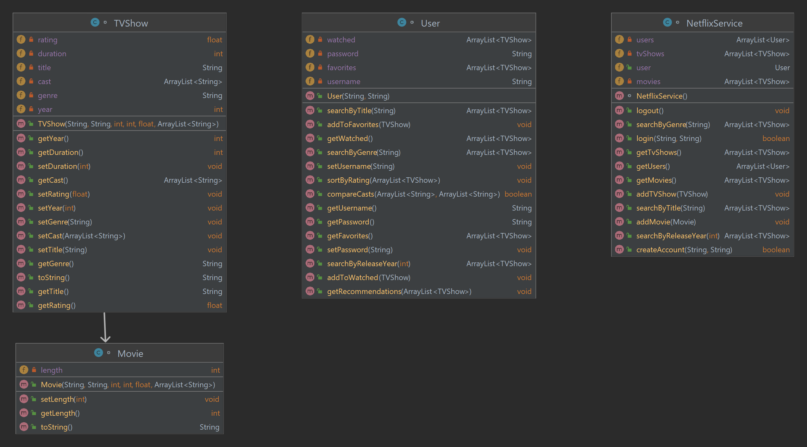

# Fourth Assignment Report

## Introduction
In  this assignment, I tried to implement a small service like Netflix in which
a user can search for different shows, add shows to the service and make a list
of favorites. The program can offer recommendations based on favorites.
The goal of the assignment is to get familiar with object-oriented programming
principles like Encapsulation, Inheritance and Polymorphism.

## Design and Implementation
There are four classes other than main. You can see the UML below:

- `TVShow` class has attributes like `title`, `year`, `genre`, `rating`, `duration` and `cast`. `Movie` inherits from `TVShow`, so it has all those attributes.
It also has `length` which is not in the super class.
Both of them have getter/setter methods for every variable. 
- In `User` there are search methods among the favorite shows and add to favorite/watched list methods. In `getRecommendations` method, an ArrayList of all shows is searched for similar shows to the favorite ones.
It returns shows with the same genre or cast as the favorites and shows with release years close to favorites(within 5 years).
- In `NetflixService`, there are the same search and add methods but for all the shows in the service.
`login` and `logout` methods change the `User` object in the service.
In `createAccount`, it returns false if the new username is already taken.
The `password` must be more than 7 characters.

## Testing and Evaluation
At first attempts, there were some problems with showing the list of movies because
they may have been empty and the user was asked to choose one of them and because there were nothing to choose from, the program would stop working.
So, I always check if the found shows ArrayList is empty or not.  
Overall, I think it works properly and meets the objectives of the assignment.

## Conclusion
I got familiar with object-oriented programming and designed a complete interactive menu.  
Since the program doesn't have any show-related data itself, it is not really functional in the real world.
So, it would be a good idea to link a movie service like IMDB to the program to have a big data of movies for browsing.
It would also be more functional to keep track of users' activities by saving their data in a file and access it whenever needed.